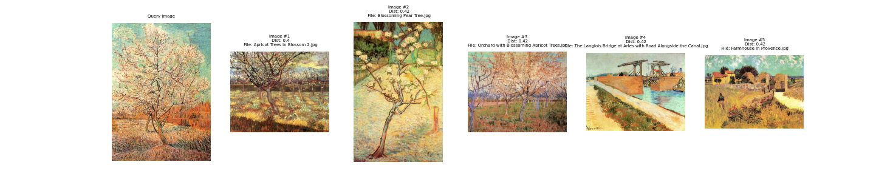
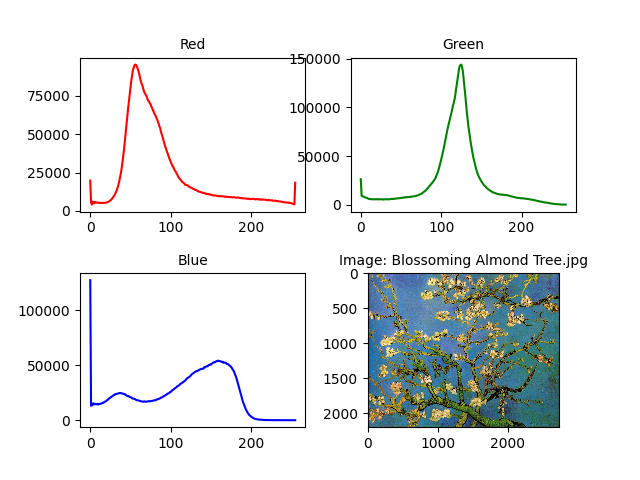
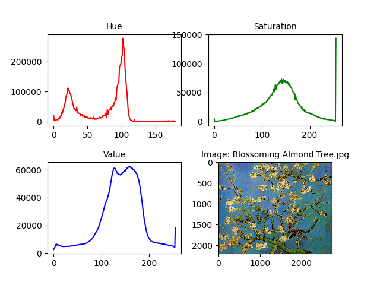
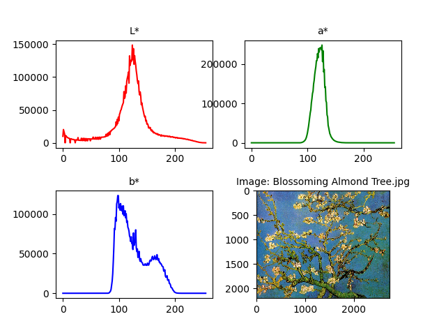
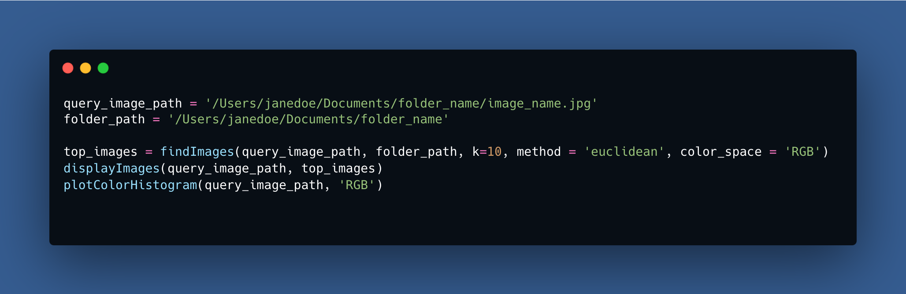

# Color-Based Image Retrieval Algorithm and Color Histogram Generator

## Description
This project is a color-based image retrieval algorithm that allows users to compare and retrieve images from a database based on their color similarity to a query image. The algorithm can extract color histograms in the color space of RGB, HSV, or CIELAB. It can also compare color histograms with the euclidean, cosine, chi2, correlation, intersection, or bhattacharyya equation. The algorithm contains helpful functions that optimizes the retrieval process for large datasets. Additionally, this program contains a function that generates the color histogram of an image in RGB, HSV, or CIELAB

## Background & Potential Uses
This algorithm is a simplified version of a project I created to help law enforcement retrieve images of indoor spaces and potentially geolocate the query image. A color-based image retrieval algorithm can also be helpful for graphic design, shopping, and art curating. It allows you to retrieve images strictly based on their color characteristics. 

## Output Examples
**Color-Based Image Retrieval:**

    

**Color Histogram Extraction:**

## Usage
For the usage instructions please look at the ['CodeDemo.py'](CodeDemo.py) file. Additionally, look at the ['ColorCBIR.py'](ColorCBIR.py) file for the code source and explanation of functions.

    

